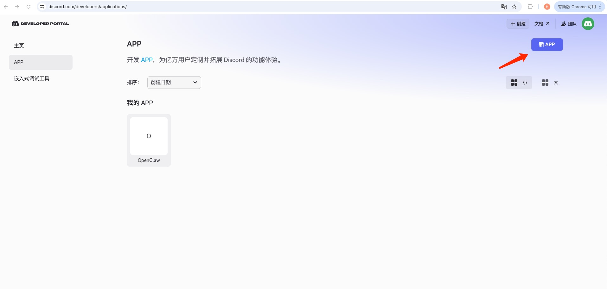
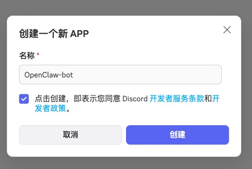
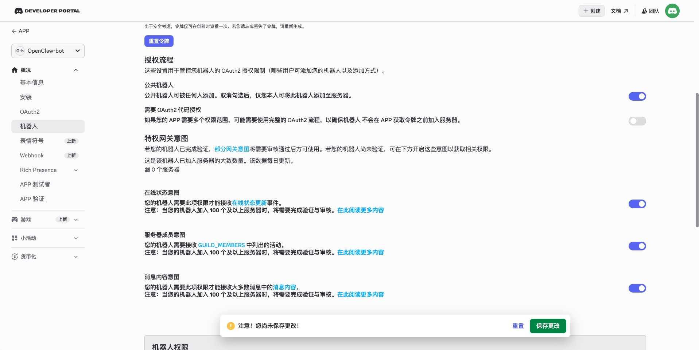
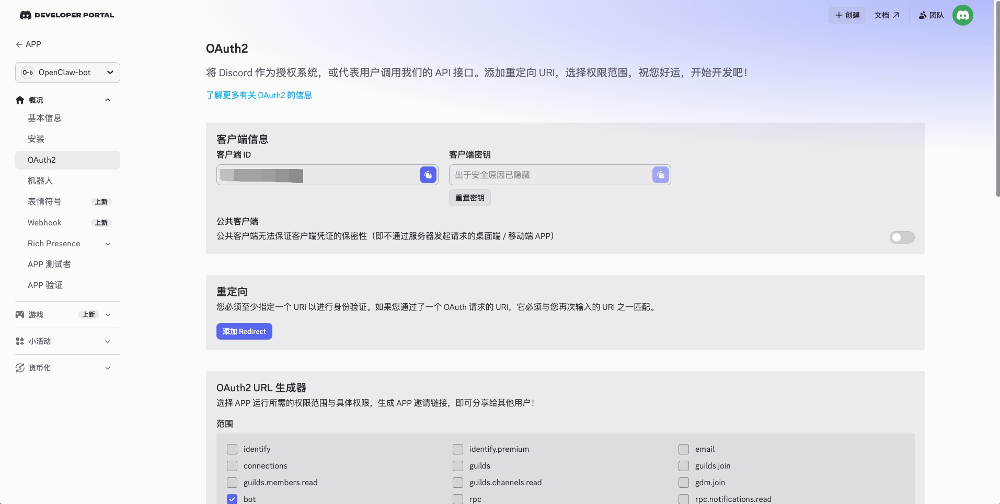
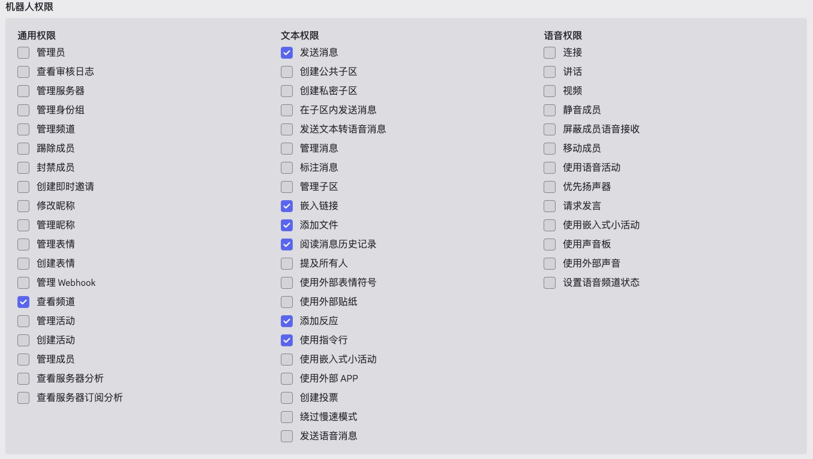
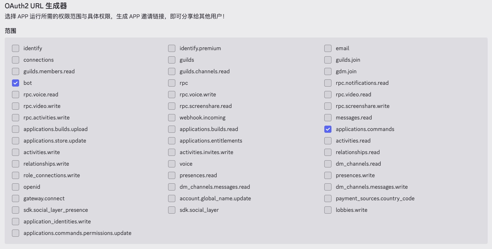
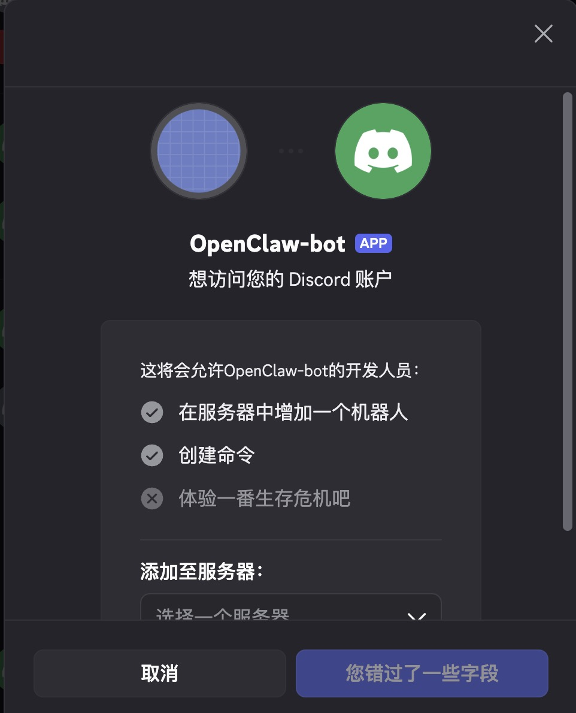

在复杂的软件开发生命周期中，利用 Docker 对 OpenClaw 进行容器化部署，可以有效隔离开发环境，从根本上解决依赖冲突与“在我的机器上能跑”的环境污染问题。本文将系统性地梳理 OpenClaw 开发环境的搭建流程，涵盖基础镜像构建、容器内编译配置以及网关网络调试等核心环节。

## 1. 准备 Dockerfile

首先，我们需要定义一个包含基础工具链的镜像。建议在宿主机创建一个专用的工作目录（例如 `~/Desktop/OpenClaw_env`），并在该目录下新建 `Dockerfile` 文件。

```Markdown
# 1. 使用您习惯的基础镜像（如 ubuntu:22.04）
FROM ubuntu:22.04

# 2. 设置环境变量（避免交互式安装时进程卡死）
ENV DEBIAN_FRONTEND=noninteractive

# 3. 设置容器内的默认工作目录
WORKDIR /app

# 4. 更新软件源并安装必要的系统扩展包
RUN apt-get update && apt-get install -y \
    git \
    vim \
    curl \
    build-essential \
    python3-pip \
    && rm -rf /var/lib/apt/lists/*

# 5. 安装 Python 相关依赖库
RUN pip install --no-cache-dir \
    numpy \
    requests \
    && echo "Extensions installed successfully."

# 6. 默认启动 bash 终端
CMD ["/bin/bash"]
```

## 2. 构建与运行容器

**构建镜像**

首先，我们需要定义一个包含基础工具链的镜像。建议在宿主机创建一个专用的工作目录（例如~/Desktop/OpenClaw_env）。然后我们进入这个额工作目录并执行构建命令，生成自定义镜像：

```Bash
cd ~/Desktop/OpenClaw_env
docker build -t OpenClaw-env .
```

**创建并启动容器**

通过 -v 参数将宿主机的开发目录挂载到容器内，以实现宿主机与容器间的代码实时同步：

```Bash
# 后台启动并挂载目录
docker run -itd --name OpenClaw -v ~/Desktop/OpenClaw_env:/app OpenClaw-env

# 进入容器内部的交互式终端
docker start OpenClaw
docker exec -it OpenClaw /bin/bash
```

## 3. 容器内环境配置
进入容器后，我们需要手动部署 OpenClaw 的底层编译依赖以及 Node.js 运行环境。

**安装编译依赖**

```Bash
apt-get update
apt-get install -y cmake build-essential libsdl2-dev libglew-dev git
```

我们将选择npm工具完成OpenClaw的配置，这是OpenClaw官方较为推荐的做法。下面按照以下步骤部署最新的 LTS 版本：

```Bash
# 1. 更新软件包列表并安装 curl 下载工具
apt-get update
apt-get install -y curl

# 2. 获取 Node.js 22 版本的官方安装脚本并执行
curl -fsSL https://deb.nodesource.com/setup_22.x | bash -

# 3. 安装 Node.js（npm 会自动跟随安装）
apt-get install -y nodejs
```

## 4. OpenClaw 部署

**安装与初始化**

在这一步我们完成OpenClaw的配置

```Bash
npm i -g OpenClaw@latest
OpenClaw onboard
```

在配置OpenClaw的过程中，我们需要依次按照OpenClaw的安装指引进行一系列的操作。在这里，作者使用了KiMi模型作为对话的基础，使用Discord作为外接的应用程序。如需其他程序的教程，可能会在后续补充。

本博客仅展示OpenClaw的配置以及与软件链接的过程，因此关于Skills和Hooks的配置都选择了跳过。

```Markdown
◇  I understand this is personal-by-default and shared/multi-user use requires lock-down. Continue?
│  Yes
│
◇  Onboarding mode
│  QuickStart
│
◇  QuickStart ─────────────────────────╮
│                                      │
│  Gateway port: 18789                 │
│  Gateway bind: Loopback (127.0.0.1)  │
│  Gateway auth: Token (default)       │
│  Tailscale exposure: Off             │
│  Direct to chat channels.            │
│                                      │
├──────────────────────────────────────╯
│
◇  Model/auth provider
│  Moonshot AI (Kimi K2.5)
│
◇  Moonshot AI (Kimi K2.5) auth method
│  Kimi API key (.cn)
│
◇  How do you want to provide this API key?
│  Paste API key now
│
◇  Enter Moonshot API key (.cn)
│  【your API Key. e.g.: sk-xxxx】
│
◇  Model configured ────────────────────────╮
│                                           │
│  Default model set to moonshot/kimi-k2.5  │
│                                           │
├───────────────────────────────────────────╯
│
◇  Default model
│  Keep current (moonshot/kimi-k2.5)
│
◇  Channel status ────────────────────────────╮
│                                             │
│  Telegram: needs token                      │
│  WhatsApp (default): not linked             │
│  Discord: configured                        │
│  Slack: needs tokens                        │
│  Signal: needs setup                        │
│  signal-cli: missing (signal-cli)           │
│  iMessage: needs setup                      │
│  imsg: missing (imsg)                       │
│  IRC: not configured                        │
│  Google Chat: not configured                │
│  LINE: not configured                       │
│  Feishu: install plugin to enable           │
│  Google Chat: install plugin to enable      │
│  Nostr: install plugin to enable            │
│  Microsoft Teams: install plugin to enable  │
│  Mattermost: install plugin to enable       │
│  Nextcloud Talk: install plugin to enable   │
│  Matrix: install plugin to enable           │
│  BlueBubbles: install plugin to enable      │
│  LINE: install plugin to enable             │
│  Zalo: install plugin to enable             │
│  Zalo Personal: install plugin to enable    │
│  Synology Chat: install plugin to enable    │
│  Tlon: install plugin to enable             │
│                                             │
├─────────────────────────────────────────────╯
│
◇  How channels work ───────────────────────────────────────────────────────────────────────╮
│                                                                                           │
│  DM security: default is pairing; unknown DMs get a pairing code.                         │
│  Approve with: OpenClaw pairing approve <channel> <code>                                  │
│  Public DMs require dmPolicy="open" + allowFrom=["*"].                                    │
│  Multi-user DMs: run: OpenClaw config set session.dmScope "per-channel-peer" (or          │
│  "per-account-channel-peer" for multi-account channels) to isolate sessions.              │
│  Docs: channels/pairing                                                                   │
│                                                                                           │
│  Telegram: simplest way to get started — register a bot with @BotFather and get going.    │
│  WhatsApp: works with your own number; recommend a separate phone + eSIM.                 │
│  Discord: very well supported right now.                                                  │
│  IRC: classic IRC networks with DM/channel routing and pairing controls.                  │
│  Google Chat: Google Workspace Chat app with HTTP webhook.                                │
│  Slack: supported (Socket Mode).                                                          │
│  Signal: signal-cli linked device; more setup (David Reagans: "Hop on Discord.").         │
│  iMessage: this is still a work in progress.                                              │
│  LINE: LINE Messaging API webhook bot.                                                    │
│  Feishu: 飞书/Lark enterprise messaging with doc/wiki/drive tools.                        │
│  Nostr: Decentralized protocol; encrypted DMs via NIP-04.                                 │
│  Microsoft Teams: Bot Framework; enterprise support.                                      │
│  Mattermost: self-hosted Slack-style chat; install the plugin to enable.                  │
│  Nextcloud Talk: Self-hosted chat via Nextcloud Talk webhook bots.                        │
│  Matrix: open protocol; install the plugin to enable.                                     │
│  BlueBubbles: iMessage via the BlueBubbles mac app + REST API.                            │
│  Zalo: Vietnam-focused messaging platform with Bot API.                                   │
│  Zalo Personal: Zalo personal account via QR code login.                                  │
│  Synology Chat: Connect your Synology NAS Chat to OpenClaw with full agent capabilities.  │
│  Tlon: decentralized messaging on Urbit; install the plugin to enable.                    │
│                                                                                           │
├───────────────────────────────────────────────────────────────────────────────────────────╯
│
◇  Select channel (QuickStart)
│  Discord (Bot API)
│
◇  Discord bot token ──────────────────────────────────────────────────────────────────────╮
│                                                                                          │
│  1) Discord Developer Portal → Applications → New Application                            │
│  2) Bot → Add Bot → Reset Token → copy token                                             │
│  3) OAuth2 → URL Generator → scope 'bot' → invite to your server                         │
│  Tip: enable Message Content Intent if you need message text. (Bot → Privileged Gateway  │
│  Intents → Message Content Intent)                                                       │
│  Docs: discord                                                                           │
│                                                                                          │
├──────────────────────────────────────────────────────────────────────────────────────────╯
│
◇  How do you want to provide this Discord bot token?
│  Enter Discord bot token
│
◇  Enter Discord bot token
│  【Your discord bot token】
│
◇  Configure Discord channels access?
│  Yes
│
◇  Discord channels access
│  Allowlist (recommended)
│
◇  Discord channels allowlist (comma-separated)
│  【your discord channels. e.g.: 12345678/#general】
│
◇  Discord channels ─────────────────────────────────────────╮
│                                                            │
│  Unresolved (kept as typed): 1480702678332997833/#general  │
│                                                            │
├────────────────────────────────────────────────────────────╯
│
◇  Selected channels ────────────────────────────────────────────╮
│                                                                │
│  Discord — very well supported right now. Docs:                │
│  discord                                                       │
│                                                                │
├────────────────────────────────────────────────────────────────╯
Updated ~/.OpenClaw/OpenClaw.json
Workspace OK: ~/.OpenClaw/workspace
Sessions OK: ~/.OpenClaw/agents/main/sessions
│
◇  Web search ────────────────────────────────────────╮
│                                                     │
│  Web search lets your agent look things up online.  │
│  Choose a provider and paste your API key.          │
│  Docs: https://docs.OpenClaw.ai/tools/web           │
│                                                     │
├─────────────────────────────────────────────────────╯
│
◇  Search provider
│  Skip for now
│
◇  Skills status ─────────────╮
│                             │
│  Eligible: 4                │
│  Missing requirements: 40   │
│  Unsupported on this OS: 7  │
│  Blocked by allowlist: 0    │
│                             │
├─────────────────────────────╯
│
◇  Configure skills now? (recommended)
│  No
│
◇  Hooks ──────────────────────────────────────────────────────────────────╮
│                                                                          │
│  Hooks let you automate actions when agent commands are issued.          │
│  Example: Save session context to memory when you issue /new or /reset.  │
│                                                                          │
│  Learn more: https://docs.OpenClaw.ai/automation/hooks                   │
│                                                                          │
├──────────────────────────────────────────────────────────────────────────╯
│
◇  Enable hooks?
│  Skip for now

```

## 5. Discord机器人配置
本文作者主要参照[OpenClaw官方提供的Discord安装教程](https://docs.openclaw.ai/channels/discord)实现的Discord机器人的安装。

首先，进入[Discord Developer Portal](https://discord.com/developers/applications/)中，添加新的APP



然后，给这个项目起一个名字


之后，点击左侧**机器人**页面，设置机器人的授权意图如图所示：


然后，点击左侧**OAuth2**界面，进行进一步配置


在OAuth2中，对**机器人权限**进行配置


在OAuth2中，对**OAuth2 URL生成器**进行配置


完成以上配置，将下方生成的链接复制到浏览器中


最后，让机器人加入你的Discord服务器中



## 6. 网关配置

**解决网络与网关链接问题**

如果在启动时遇到 Health check failed: gateway closed 错误，这通常是因为默认的 loopback (localhost) 绑定无法在 Docker 的桥接网络模式下被外部正常访问。

面对这个问题，我们首先需要进入配置目录并调整网关的绑定策略。

```Bash
cd /root/.OpenClaw/
```

将 OpenClaw.json 中的 gateway 字段进行如下修改：

```JSON
// 修改前
"gateway": {
        "port": 18789,
        "mode": "local",
        "bind": "loopback",
....
}

// 修改后
"gateway": {
        "port": 18789,
        "mode": "local",
        "bind": "lan",
....
}
```

**手动启动网关**

配置完成后，通过以下命令指定端口和局域网绑定模式启动网关：

```Bash
OpenClaw gateway --port 18789 --bind lan
```

启动网关后，在Discord和bot对话，获得配对码，再将配对码输入到OpenClaw的控制台中，就可以将OpenClaw和Discord配对:


注意：如果系统抛出 OpenClaw: access not configured 的提示，请记录控制台输出的 Pairing code，并及时联系 Bot 管理员完成设备授权。


希望这篇指南能帮助您快速扫清 OpenClaw 容器化部署的障碍！如果您在配置过程中遇到任何网络转发或依赖安装的疑难杂症，欢迎进一步交流。